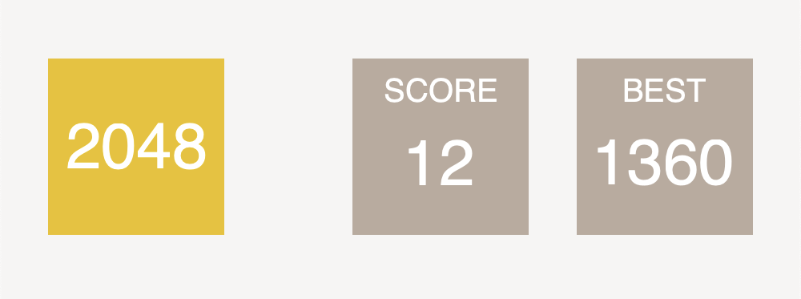

# 2048 Game Implementation in C# with GTK#

## Description

This project is an implementation of the classic 2048 game using C# and GTK#. The game features a graphical user interface for a 4x4 grid where players can use arrow keys to move and merge tiles. The goal is to reach the elusive 2048 tile.

## Game Features

- **Score Tracking:** The game keeps track of the player's current score and best score.
- **Random Number Generation:** New tiles with values of 2 or 4 are generated randomly on the board.
- **Move and Merge:** Tiles can be moved in four directions (up, down, left, right), and tiles with the same value merge into one when moved towards each other.
- **Game Over Check:** The game checks for a "game over" condition when no more moves are possible.

## Getting Started

To run the game, follow these steps:

1. Ensure you have the necessary dependencies installed, including GTK#.
2. Install the GTK# package using the following command:

    ```bash
    dotnet add package GtkSharp
    ```

3. Compile the C# code using your preferred compiler.

4. Run the compiled executable to start the game using the following command:

    ```bash
    dotnet run
    ```

## How to Play

- Use the arrow keys (Up, Down, Left, Right) to move tiles on the game board.
- Tiles with the same value merge when moved towards each other.
- The goal is to reach the 2048 tile.

## Code Overview

The implementation consists of two main classes:

- **Game:** Represents the game logic, including board manipulation, scoring, and checking for game-over conditions.

- **Area:** A GTK# DrawingArea responsible for rendering the game board. It uses Cairo to draw the graphical elements of the game.

- **MyWindow:** A GTK# Window that initializes the game and handles user input.

## Dependencies

- GTK#: The game relies on GTK# for the graphical user interface.


## Screenshots

Check out the visual representation of the 2048 game in action. These screenshots showcase the user interface, game board, and the exciting moments of tile movement and merging.




## License

This project is licensed under the [MIT License](LICENSE).
